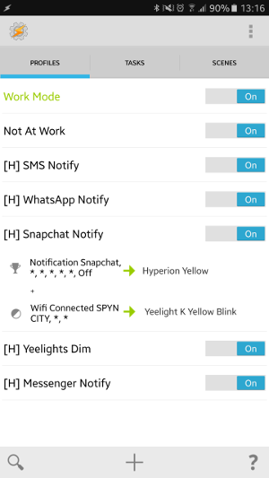
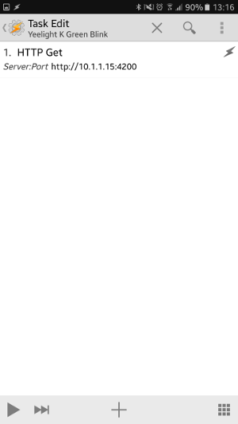
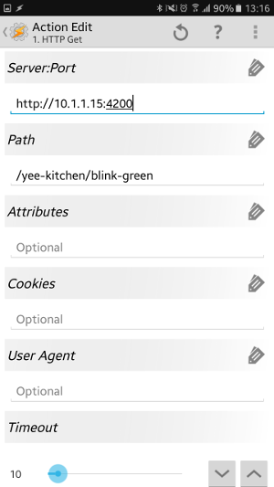
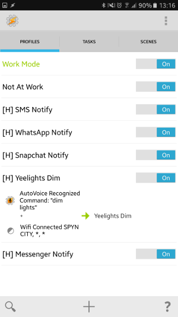
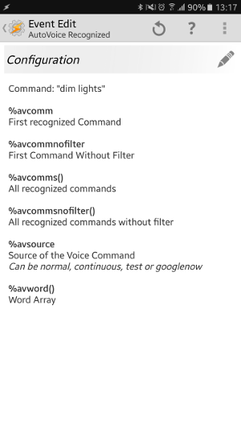

Over the last week I've been looking into creating a basic web-service to easily interact with my lights around my flat. Currently, I have two Yeelights and a LightPack, which is located on the back of my TV.

### Stuff tied into this

- [Raspberry Pi 1 Model B](https://www.raspberrypi.org/products/model-b/)
- [Tasker](https://play.google.com/store/apps/details?id=net.dinglisch.android.taskerm&hl=en)
- [AutoVoice](https://play.google.com/store/apps/details?id=com.joaomgcd.autovoice&hl=en)
- [Hyperion](https://hyperion-project.org/)
- [Lightpack 1](http://www.lightpack.tv/)
- [Yeelights](https://www.aliexpress.com/item/Original-Xiaomi-Yeelight-II-Smart-LED-Bulb-E27-9W-600-Lumens-Mi-Light-Smart-Phone/32671682019.html) (~$20 USD)
- [python-yeelight](http://yeelight.readthedocs.io/en/stable/index.html)

### Cool things it can do RIGHT NOW
  
- Turn lights on when my phone connects to WiFi
- Notifications lights from my phone, passed on by Tasker 
- [IFTTT](http://ifttt.com) events 
- Voice activated lighting cues, eg *OK GOOGLE DIM LIGHTS*, turn off, shut up etc using AutoVoice with Tasker
- Basic [web dashboard](/images/illuminate_webinterface.png) to fire off effects to devices 
- Using [intents](http://sleep.urbandroid.org/documentation/developer-api/intents-and-content-providers/) from (Sleep As A Droid)[https://play.google.com/store/apps/details?id=com.urbandroid.sleep&hl=en], turn off my lights when it's time to go to bed
- ~~Let people on the internet mess around with my light globes; this is a good idea~~

### Cool things I'm thinking about doing with it

- Automatically adjust globe brightness depending on sunrise and sunset
    - Get GPS co-ordinates [from here](http://thegpscoordinates.net/australia/perth)
    - Then use this API to return the current sunrise/sunset http://sunrise-sunset.org/api
    - So, Perth would be http://api.sunrise-sunset.org/json?lat=-31.953&lng=115,8575&date=today (Adjust for GMT obvs)
- Audio queues and text to speech from the Raspberry Pi

### The CODE

I'm running a SimpleHTTP server in Python to handle all GET requests. The requests check to see, firstly, if the device exists and if so, what effect to run on it. As an example: http://localhost:5000/device/effect. I thought this would make it easy to simply craft a HTTP GET rather than posting JSON to it. Also means I can use Tasker without having to use the Send/Except plugin, which is fine and also great, but takes a bit to setup. Not that I'm lazy or anything. It also means I can use IFTTT's Maker to easily hit the *AIR QUOTES* API *AIR QUOTES*

You can [view my source on github](https://github.com/spyn/illuminate). It was written over a few days and strongly requires a re-factor.

### Setting up Tasker

This can be a repetative process, but you can also copy the tasks you edit. AutoVoice is completely optional of course, and only if you're a giant nerd and want to tell OK Google to do stuff. Also excuse the ridiculously sized images. 

Creating a task is fairly simple. You just need to use HTTP Get to push commands off to the Python *webapi*

- While on the tasks tab...
- New Task Name => ~whateva~
- Plus => Net => HTTP Get
- Enter the URL for the illuminate webserver and the device and effect, eg. http://10.1.1.69:5000/cool_light/good_effect

So, my profile for my Snapchat notification is this: . To do this..

- While on the profile tab...
- Press the plus button, then Add Event => UI Event => Notification
  - Add Event
  - UI Event
  - Notification
  - Owner Application => Select Snapechat, go back
  - Enter Task
  - Hyperion Yellow
  - Hold down finger on the Hyperion Yellow task
  - Add Task
  - Yeelight K Yellow Blink
  - Hold finger down on Notification
  - Add State 
  - Net => Wifi Connected
  - SSID => Enter your SSID for your WiFi
  - Done!

Breaking it down...

- Once we get a notification from the App Snapchat *AND* if we're connected to my local WiFi:
  - Run task Hyperion Yellow, which will light my TV's backlights yellow
  - Run task Yeelight K Yellow Blink, which will blink the kitchen Yeelight

 | 

My "OK Google Dim Lights" profile is as follows:

- Once we get the voice command 'Dim Lights' *AND* if we're connected to my local WiFi
  - Run task Yeelight Dim

The configuration for the above event looks like this: 

### Yeelights

Yes, you can ping your light globes now; what a future we live in.

It took me a while to workout how to enable the TCP JSON service on these lights. Turns out you need to download the [Developer Mode](https://www.yeelight.com/en_US/developer) application, then enable developer mode on each light globe. Xiaomi have also included a very comprehensive [API documentation](https://www.yeelight.com/download/Yeelight_Inter-Operation_Spec.pdf). But I'm being super lazy and using the [python-yeelight](http://yeelight.readthedocs.io/en/stable/index.html) package because it does pretty much everything I want it to do.

### Overall

It was a pretty fun project. I think I'll need to upgrade my Raspberry Pi if I'm going to be adding text-to-speech. It's already processing video through to Hyperion!
Also, please don't DDoS my lightbulbs. Thank you kindly. 

