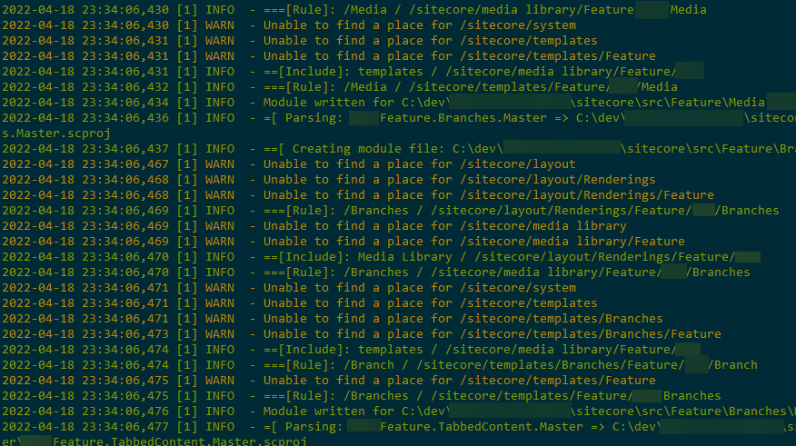

## Migrating to SCS from TDS!

This is a cheeky lil command line interface tool to convert TDS projects to CSC modules

When looking at the daunting amount of TDS projects that our Sitecore solution has, I decided to whip up a quick migration command line application that parses each TDS project and item in the solution.
It will then generate a basic module skeleton based off the TDS project. It also takes into account for any Helix modules that exist in the solution, and will try to add includes and filters based off that.
It will require some manual intervention after the module files have been created, to tease out the additional items you would like synchronised.

Obviously the script isn't 100%, and you will need to still create additional modules for the edge cases, eg /sitecore/system but it'll give you a good start!

The code can be found on my [Github](https://github.com/spyn/tds2scs)
