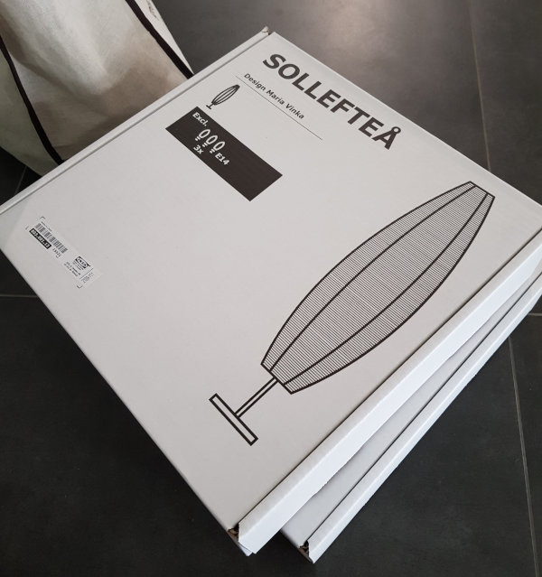
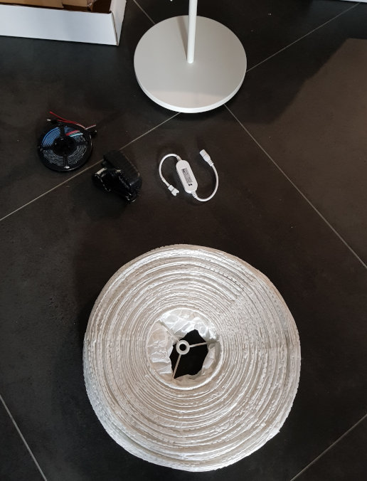
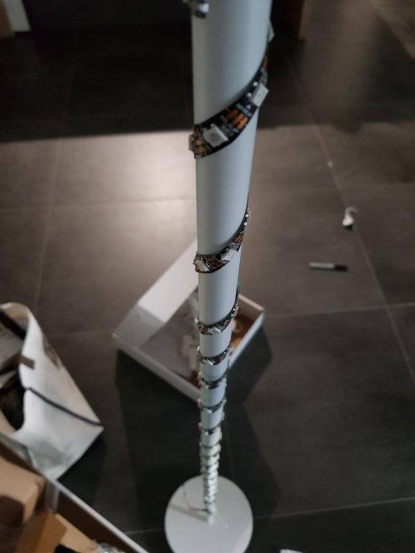
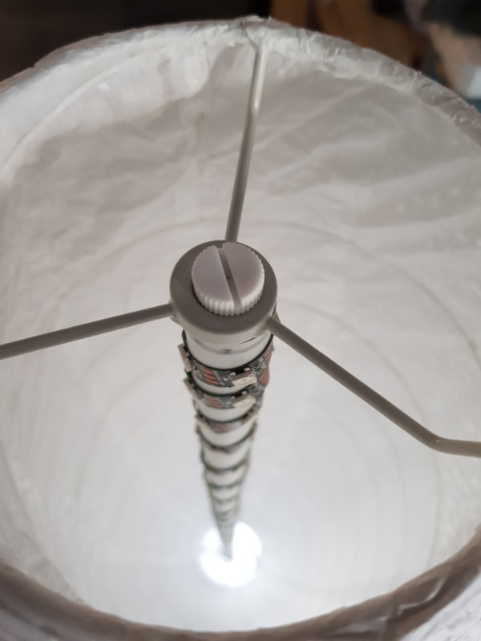
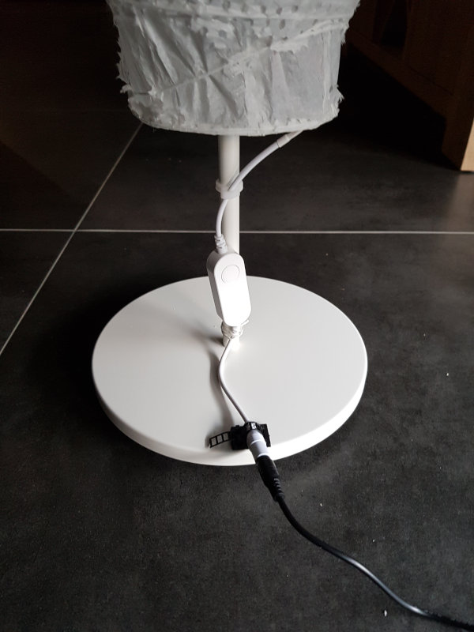

## Making a WLED based standing lamp


### List of the hardware used
I have tried to do this on the cheap, and get the most basic hardware. Basically, I needed a power adaptor that can handle 5V and 3A, an addressable LED strip, a Tuya based controller with WiFi and a lamp I can easily modify. These are the parts:
- [AC100-240V to DC5V 3A Power Adapter](https://www.aliexpress.com/item/32917316738.html) AU $8.07
- [ATHOM Pre-flashed Tastmota WLED WS2812B LED Light Strip Controller V5](https://www.aliexpress.com/item/1005002099128276.html) AU $18.38
- [WS2812B White PCB 2M 60 IP30 LED Strip](https://www.aliexpress.com/item/2036819167.html) AU $14.24
- [SOLLEFTEÅ Floor Lamp](https://www.ikea.com/au/en/p/solleftea-floor-lamp-oval-white-80300113/) AU $29.99

### Software used
Have been interested in using WLED, and needed to find a project where I can use it in. 
- [Aircoookie's WLED](https://github.com/Aircoookie/WLED) - Firmware used on the light strip controller

### Hardware setup
 


I went with the [SOLLEFTEÅ Floor Lamp](https://www.ikea.com/au/en/p/solleftea-floor-lamp-oval-white-80300113/) from [IKEA](https://www.ikea.com) because I like the shape, and it was a decent height. I was looking for around 1 metre to wrap the LED strip around.



Here's all the parts used in this build.



And the afters of me wrapping the LEDs around the lamp stand. It was hard to get it consistant, but because the white paper from the lamp defuse the light somewhat, it'll do.



Looking down from the top with the lamp's paper all dressed up.



Yeah I could have done this a bit cleaner, but I'll go back and fix it later (I won't)

The device that I got from ATHOM, came pre-flashed with a version of Tasmota. With lighting, Tasmota is really good for globes and non-addressable lights, but since I got a WS2812B LED strip, time to take advantage of [WLED](https://github.com/Aircoookie/WLED)! 

[WLED](https://github.com/Aircoookie/WLED) is a feature rich firmware running on ESP8266/ESP32 based devices. It has HTTP, JSON and MQTT support and a bunch of other really cool interfaces. You can see more information on the GitHub page.

A basic setup guide comes with the ATHOM controller, and essentially you need to get that configured for your network then connect to the web service. 

To flash the light strip controller, I downloaded the [```WLED_0.12.0_ESP8266.bin```](https://github.com/Aircoookie/WLED/releases/tag/v0.12.0) release from the WLED release page on GitHub. Then, I had to gzip the file, in order for it to fit on the controller. 

Once uploaded, it'll take a minute to flash and then you should see a WLED-AP popup on your WiFi network. Connect to the WLED-AP with the default password, and now you should have access to WLED!

### Home Assistant

After tweaking the network settings, as I'm using a DHCP server. I've assigned static IP addresses to the lamps to make it easier to assign in Home Assistant. You can easily add them through the integration section, and they just work!

### Retrospect

I think I killed most the effects with too many LEDs - 1m strip (60 LEDs) stretched would have been more then enough. 
